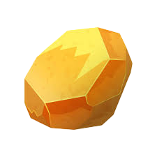
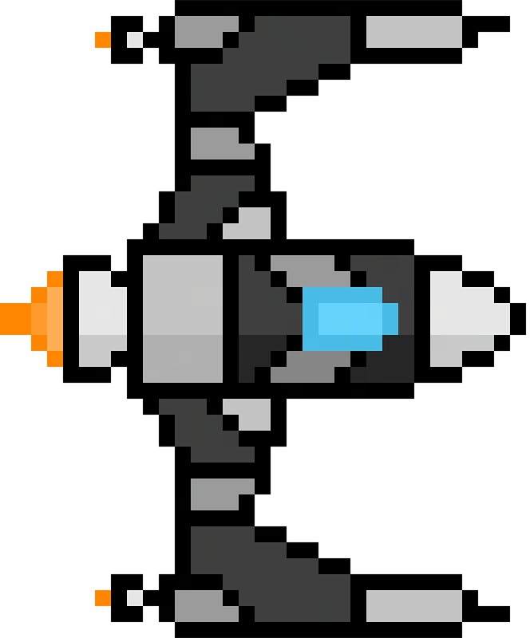

# JeuxDevWeb

Ce projet est une collection de trois jeux web développés en HTML, CSS et JavaScript avec un backend Node.js et une base de données MySQL.

## 🎮 Les Jeux

### 1. Minor Clicker
Un jeu de type clicker où vous devez cliquer sur une pépite d'or pour gagner des points et améliorer votre production.

### 2. Deep Space Survivor
Un jeu de survie spatial où vous contrôlez un vaisseau qui doit survivre à des vagues d'ennemis de plus en plus difficiles.

### 3. Serpent Rush
Un jeu de labyrinthe où vous devez atteindre la sortie tout en évitant un serpent qui vous poursuit.

## 👥 Membres du groupe

- Romain STEFANI (Alternant)
- Clara TORRI (Alternante)

## 📖 Règles des jeux

- [Règles de Minor Clicker](docs/rules-game1.md)
- [Règles de Deep Space Survivor](docs/rules-game2.md)
- [Règles de Serpent Rush](docs/rules-game3.md)

## 🔧 Documentation technique

Pour plus de détails techniques sur chaque jeu, consultez les README dédiés:

- [Documentation technique de Minor Clicker](src/front/games/game1/README.md)
- [Documentation technique de Deep Space Survivor](src/front/games/game2/README.md)
- [Documentation technique de Serpent Rush](src/front/games/game3/README.md)

## 📝 Fonctionnalités

- Système d'authentification (inscription/connexion)
- Sauvegarde des scores
- Interface responsive
- Backend Node.js
- Base de données MySQL

## 🎨 Technologies utilisées

- Frontend: HTML, CSS, JavaScript
- Backend: Node.js, Express
- Base de données: MySQL
- Déploiement: Railway (BDD)